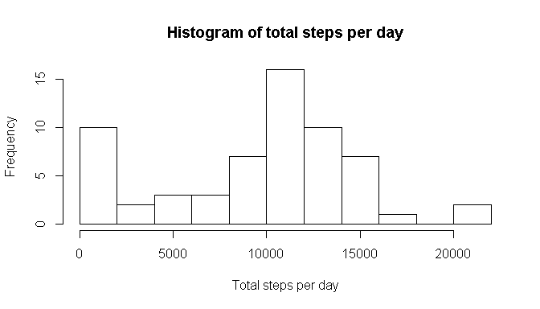
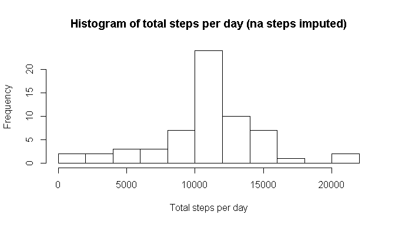
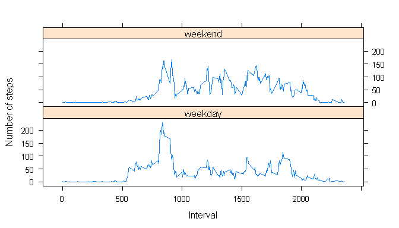

# Reproducible Research: Peer Assessment 1
LexoL  
January 10, 2016  

## Loading and preprocessing the data

## 1. Code for reading in the dataset and/or processing the data


```r
if(!require(dplyr, quietly = TRUE, warn.conflicts = FALSE)){
        stop('I need dplyr library. Please run install.packages("dplyr")!')
        }
if(!require(lubridate, quietly = TRUE, warn.conflicts = FALSE)){
        stop('I need lubridate library. Please run install.packages("lubridate")!')
        }
if(!require(lattice, quietly = TRUE, warn.conflicts = FALSE)){
        stop('I need lattice library. Please run install.packages("lattice")!')
        }
   
if(!file.exists("activity.zip")){
        stop(paste('I need activity.zip file in the working directory.',
                  'Please copy activity.zip file into your working directory!',
                   sep = "\n"))
        }


df.activity <- read.csv(unz("activity.zip", "activity.csv"), header = TRUE, stringsAsFactors = FALSE)
tbl.activity <- tbl_df(df.activity)
rm("df.activity")

tbl.activity <- mutate(tbl.activity, date = ymd(date))

tbl.by_date <- group_by(tbl.activity,date)
total <- summarize(tbl.by_date, totalperday = sum(steps, na.rm = TRUE))
```

## Histogam 2
2. Histogram of the total number of steps taken each day


```r
with(total, hist(totalperday,breaks = 8, xlab = "Total steps per day",
                 main = "Histogram of total steps per day"))
```

\

## What is mean total number of steps taken per day?
3. Mean and median number of steps taken each day

For steps taken each day, the mean is 9354.2295082
and median is 10395. 


## What is the average daily activity pattern?
4. Time series plot of the average number of steps taken


```r
tbl.by_interval <- group_by(tbl.activity, interval)
interval_average <- summarize(tbl.by_interval, averageperinterval = mean(steps, na.rm = TRUE))
```

Draw plot


```r
with(interval_average, plot(interval, averageperinterval, type = "l", 
                            col = "blue", xlab = "5 minute interval no.", 
                            ylab = "Average number of steps per interval"))
title(main = "Plot of average number of steps per interval")
```

\

5. The 5-minute interval that, on average, contains the maximum number of steps

The index of the 5-minute interval, on average across all the days in the dataset, contains the maximum number of steps is 835, at which the the average number of steps reach maximum that equals 206.1698113. 


## Imputing missing values
6. Code to describe and show a strategy for imputing missing data

The total number of observation with NA in the dataset is 2304.

To fill in of the missing values, we substitute each of them with the mean value of average values for the corresponding interval. 


```r
tbl.steps_imputed <- tbl.activity
interval_average$subst_steps <- sapply(interval_average$averageperinterval,  
                                          function(x) as.integer(round(x,0)))

tbl.steps_imputed <- tbl.steps_imputed %>%
        merge(interval_average, by.x = "interval", by.y = "interval", all.x = TRUE) %>%
        mutate(steps = ifelse(is.na(steps), subst_steps, steps)) %>%
        select(steps,  date, interval) %>%
        arrange(date,interval)

tbl.imputed_by_date <- group_by(tbl.steps_imputed,date)
total_imputed <- summarize(tbl.imputed_by_date, totalperday = sum(steps, na.rm = TRUE))
```

7. Histogram of the total number of steps taken each day after missing values are imputed

Histogram of the total number of steps taken each day (imputed)


```r
with(total_imputed , hist(totalperday,breaks = 8, xlab = "Total steps per day", 
     main = "Histogram of total steps per day (na steps imputed)"))
```

\
    
HEADING!!! INTERPRETATION OF CHANGES    

Mean and median number of steps taken each day (imputed)   

For steps taken each day (imputed), the mean is 1.0765639\times 10^{4}
and median is 10762. 


## Are there differences in activity patterns between weekdays and weekends?

8. Panel plot comparing the average number of steps taken per 5-minute interval across weekdays and weekends


```r
tbl.imputed_by_weekday.type_interval <- tbl.steps_imputed %>% 
        mutate(weekday.type = ifelse (between(wday(date), 2,6), "weekday", "weekend")) %>%
        transform(weekday.type = factor(weekday.type)) %>%
        group_by(weekday.type, date, interval) %>%
        summarize(averagepertypedateinterval= mean(steps, na.rm = TRUE)) %>%
        group_by(weekday.type, interval) %>%
        summarize(averagepertypeinterval = mean(averagepertypedateinterval, na.rm = TRUE)) 
```

Draw the plot


```r
xyplot(averagepertypeinterval ~ interval | weekday.type, data = tbl.imputed_by_weekday.type_interval, 
       layout = c(1, 2), type = 'l', xlab = "Interval", ylab = "Number of steps")
```

\


