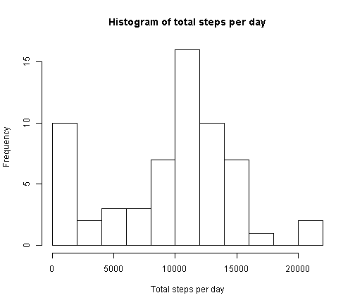

-- **YAML header was disabled, to make knitr2html() runnable against this Rmd file.**   
title: "Reproducible Research: Peer Assessment 1"  
author: LexoL  
date: January 10, 2016   
output:    
  html_document:   
    Keep_md: true   
---

The report falls into 8 sections just in correspondence to the first eight steps of the course project assignment. The ninth step need not be presented in this report: the last step is about the report saving and submitting. 


## 1. Code for reading in the dataset and/or processing the data


First, we check if all the libraries and file are available. 


```r
if(!require(dplyr, quietly = TRUE, warn.conflicts = FALSE)){
        stop('I need dplyr library. Please run install.packages("dplyr")!')
        }
if(!require(lubridate, quietly = TRUE, warn.conflicts = FALSE)){
        stop('I need lubridate library. Please run install.packages("lubridate")!')
        }
if(!require(lattice, quietly = TRUE, warn.conflicts = FALSE)){
        stop('I need lattice library. Please run install.packages("lattice")!')
        }
   
if(!file.exists("activity.zip")){
        stop(paste('I need activity.zip file in the working directory.',
                  'Please copy activity.zip file into your working directory!',
                   sep = "\n"))
        }
```

Then, we download the dataset from the zip-file, convert it to `tbl_df`, and convert the data to a standard data format. Next we delete `df.activity` data frame since that frame is no longer needed. Finally, we group the loaded data and summarize them. The summary is represented with histogram in section 2. No `NA`s has been excluded from the analysis, yet. 


```r
df.activity     <- read.csv(unz("activity.zip", "activity.csv"), header = TRUE, stringsAsFactors = FALSE)
tbl.activity    <- tbl_df(df.activity)
tbl.activity    <- mutate(tbl.activity, date = ymd(date))

rm("df.activity")

tbl.by_date     <- group_by(tbl.activity,date)
tbl.total           <- summarize(tbl.by_date, totalperday = sum(steps, na.rm = TRUE))
```


## 2. Histogram of the total number of steps taken each day 


```r
with(tbl.total, hist(totalperday,breaks = 8, xlab = "Total steps per day", 
                     main = "Histogram of total steps per day"))
```




### Note: The Difference Between Bar Charts and Histograms

"...Here is the main difference between bar charts and histograms. With bar charts, each column represents a group defined by a categorical variable; and with histograms, each column represents a group defined by a quantitative variable...", cited from 
[Bar Charts and Histograms @ stattreck.com](http://stattrek.com/statistics/charts/histogram.aspx?Tutorial=AP)

## 3. Mean and median number of steps taken each day

For steps taken each day, the mean is 9354.2295082
and median is 10395. 


## 4. Time series plot of the average number of steps taken (what is the average daily activity pattern?)

First we group and summarize the initial data by interval (we calculate the average number of steps per each interval).


```r
tbl.by_interval         <- group_by(tbl.activity, interval)
tbl.interval_average    <- summarize(tbl.by_interval, averageperinterval = mean(steps, na.rm = TRUE))
```

Then, we represent the result with the next plot. 


```r
with(tbl.interval_average, 
     plot(interval, averageperinterval, type = "l", col = "blue", xlab = "5 minute interval no.", 
          ylab = "Average number of steps per interval"))

title(main = "Plot of average number of steps per interval")
```


## 5. The 5-minute interval that, on average, contains the maximum number of steps

The index of the 5-minute interval, on average across all the days in the dataset, contains the maximum number of steps is 835, at which the average number of steps reaches its maximum that equals 206.1698113. 


## 6. Code to describe and show a strategy for imputing missing data

The total number of observation with `NA` in the dataset is 2304.  

To fill in of the missing values, we substitute each of them with the mean value of average values for the corresponding interval. We take the average values from `tbl.interval_average`, which is already ready to use. 


```r
tbl.steps_imputed               <- tbl.activity
tbl.interval_average$subst_steps    <- sapply(tbl.interval_average$averageperinterval,  
                                          function(x) as.integer(round(x,0)))

tbl.steps_imputed               <- tbl.steps_imputed %>%
                                   merge(tbl.interval_average, by.x = "interval", by.y = "interval", all.x = TRUE) %>%
                                   mutate(steps = ifelse(is.na(steps), subst_steps, steps)) %>%
                                   select(steps,  date, interval) %>%
                                   arrange(date,interval)

tbl.imputed_by_date             <- group_by(tbl.steps_imputed,date)
tbl.total_imputed               <- summarize(tbl.imputed_by_date, totalperday = sum(steps, na.rm = TRUE))
```


## 7. Histogram of the total number of steps taken each day after missing values are imputed

The result of above transformations, grouping, and summarizing is represented with the next histogram. 


```r
with(tbl.total_imputed, hist(totalperday,breaks = 8, xlab = "Total steps per day", 
     main = "Histogram of total steps per day (na steps imputed)"))
```


    

For steps taken each day (imputed), the mean is 1.0765639 &times; 10<sup>4</sup>
and median is 10762. Let's compare these results with the earlier ones, when `NA` were not imputed (numbers were rounded), in the table below. 


```r
mean.init       <- trunc(mean(tbl.total$totalperday, na.rm = TRUE))
median.init     <- median(tbl.total$totalperday, na.rm = TRUE)

mean.imputed    <- trunc(mean(tbl.total_imputed$totalperday))
median.imputed  <- median(tbl.total_imputed$totalperday)

data.frame(row.names = c("NAs Remain","NAs Imputed", "Imp'd-Rem'n"), 
           Mean = c(mean.init, mean.imputed, mean.imputed - mean.init), 
           Median = c(median.init,median.imputed, median.imputed - median.init))
```

```
##              Mean Median
## NAs Remain   9354  10395
## NAs Imputed 10765  10762
## Imp'd-Rem'n  1411    367
```

The mean and median in the dataset, where `NA`s were imputed, are greater than those in the initial dataset. This is so because `NA`s were partially
substituted with strictly positive values that has made mean and median grow when switching consideration from the initial dataset to the dataset with
imputed values. 
    


## 8. Panel plot comparing the average number of steps taken per 5-minute interval across weekdays and weekends (Are there differences in activity patterns between weekdays and weekends?)


```r
tbl.imputed_by_weekday.type_interval <- tbl.steps_imputed %>% 
                                        mutate(weekday.type = ifelse (between(wday(date), 2,6), 
                                              "weekday", "weekend")) %>%
                                        transform(weekday.type = factor(weekday.type)) %>%
                                        group_by(weekday.type, date, interval) %>%
                                        summarize(averagepertypedateinterval= mean(steps, na.rm = TRUE)) %>%
                                        group_by(weekday.type, interval) %>%
                                        summarize(averagepertypeinterval = mean(averagepertypedateinterval, 
                                                  na.rm = TRUE)) 
```


The result is represented with the following plot lattice:


```r
xyplot(averagepertypeinterval ~ interval | weekday.type, data = tbl.imputed_by_weekday.type_interval, 
       layout = c(1, 2), type = 'l', xlab = "Interval", ylab = "Number of steps")
```


We can see some differences in activity patterns between weekdays and weekends:

- on weekdays, people begin walking earlier than on weekends
- on weekends, people walks more after the morning maximum as well as stop walking later than on weekdays
- on weekends, morning walking maximum is lower than on weekdays

We may assume that people sleep longer and need not go so far on weekends in comparison to weekdays. Still, people have more *local* walk on weekends
because they have somewhat more spare time. 
